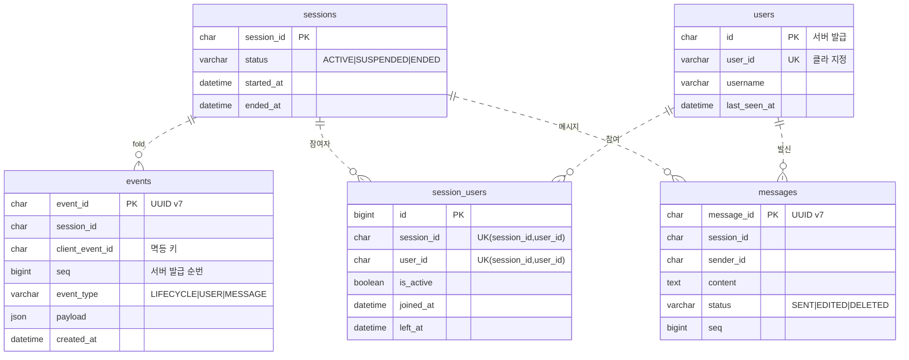

# ERD & DB 설계

전체 DDL 은 [schema.sql](schema.sql). 여기서는 테이블 관계와 인덱스 설계 근거 정리

구조: CQRS + 이벤트 소싱. `events` 에는 모든 변경이 추가만(append-only) 됨. `sessions`·`session_users`·`messages` 는 이벤트를 접어서(fold) 만든 조회 전용 읽기 모델. `users` 는 이벤트 소싱과 무관한 회원 테이블

- 점선 = 논리적 관계. 외래키(FK) 미설정(이유는 아래).
- 컬럼 길이는 생략 — 정확한 타입은 schema.sql.

## 외래키를 안 건 이유

읽기 모델은 events 만 있으면 언제든 재생성 가능한 파생 데이터. FK 를 걸면:

- 이벤트 INSERT 마다 부모 존재 확인 락 → append 지연
- "이벤트 먼저 커밋 → 읽기 모델은 나중에 비동기 반영" 흐름과 충돌
- 읽기 모델 통째 삭제·재생성이 어려워짐

→ FK 대신 애플리케이션에서 정합성 보장(멱등 프로젝션, 종료 상태 가드)

## 식별자·타입

- ID: CHAR(36) UUID v7. BINARY(16) 보다 로그·디버깅 가독성 우위. v7 은 시간순 정렬이라 PK 인덱스 단편화 적고, 세션 목록 커서로도 활용
- `events.payload`: JSON. 이벤트 종류마다 필드가 달라 컬럼으로 풀지 않고 직렬화. append-only 라 갱신 비용 없음
- `users`: 서버 발급 PK(`id`) 와 클라 지정 `user_id` 분리. `user_id` 는 로그인 아이디라 UNIQUE, `username` 은 표시 이름이라 중복 허용

## 인덱스 (핫패스 기준)

**events**

| 인덱스 | 컬럼 | 용도 |
|---|---|---|
| PK | event_id | 단건 조회 |
| uk_events_session_client | (session_id, client_event_id, event_type) | 중복 차단. 같은 clientEventId 재전송의 두 번째 INSERT 차단. 세션 생성은 한 clientEventId 로 LIFECYCLE+USER 2건 발행 → event_type 까지 묶음 |
| uk_events_session_seq | (session_id, seq) | 세션 내 순번 중복 차단 + 정렬/범위 스캔 |
| idx_events_session_created | (session_id, created_at) | 시점 복원(created_at 이하 범위) |

시점 복원은 created_at 으로 범위만 자르고 정렬은 seq. created_at 동값에도 순서 불변(DESIGN.md 순서 처리)

**sessions**

| 인덱스 | 컬럼 | 용도 |
|---|---|---|
| PK | session_id | 단건 조회 |
| idx_sessions_status / idx_sessions_started_at | status / started_at | 상태·기간 필터 목록 |

목록 커서: 별도 인덱스 없이 PK 활용. UUID v7 시간순 → `session_id < :cursor ORDER BY session_id DESC` 로 OFFSET·COUNT 없이 최신순 페이징

**session_users**

| 인덱스 | 컬럼 | 용도 |
|---|---|---|
| uk_session_user | (session_id, user_id) | 같은 (세션,유저) 중복 row 방지. 재참여는 새 row 가 아니라 기존 row 재활성화 |
| idx_session_user_user_id | user_id | 재연결 시 유저의 활성 세션 조회 |
| idx_session_user_session_id / idx_session_user_active | session_id / is_active | 참여자 목록 / 활성 필터 |

**messages**

| 인덱스 | 컬럼 | 용도 |
|---|---|---|
| PK | message_id | 단건 + 수정/삭제(이 키로 바로 갱신) |
| idx_message_session_seq | (session_id, seq) | 메시지 목록·커서 페이징·catch-up |
| idx_message_sender | sender_id | 발신자 기준 조회 |

## 남은 정리거리

- schema.sql 인덱스명(`idx_sessions_*`) vs JPA `@Index`(`idx_session_*`) 단·복수 불일치 → 정렬 필요
- schema.sql 주석은 `ddl-auto=validate` 기준이나 실제 설정은 빈 DB 부팅용 `update`. 운영은 `validate` + 마이그레이션 도구
